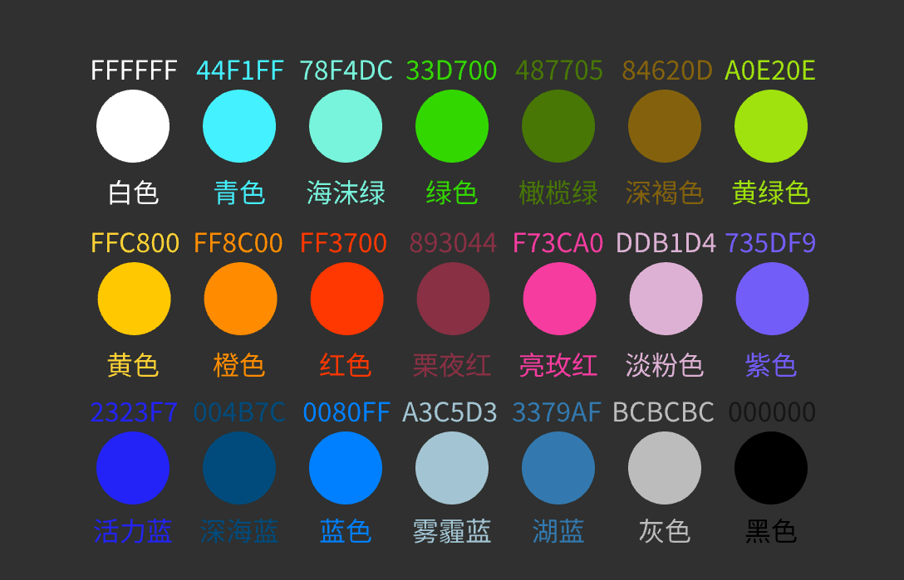

# ELEGOO-RFID-Tag-Guide

## 1. Overview
This document outlines the data structure and content format stored on the RFID tags used in ELEGOO's FDM 3D printing filament spools.

## 2. Data Structure: EPC-256 Format
The RFID tag uses a 256-bit EPC (Electronic Product Code) Type I format, which is commonly applied in IoT device identification and tracking. The total storage size is 32 bytes (256 bits), with the data fields defined as follows:

| Field | Length | Example | Description |
|-------|---------|---------|-------------|
| Header | 8 bits | 0x36 | EPC-256 identifier |
| Manufacturer Code | 32 bits | 0xEEEEEEEE | Identifies ELEGOO as the manufacturer |
| Filament Code | 16 bits | 0x0001 | Internal filament code by manufacturer |
| Material (Main) | 32 bits | 0x00807665 ("PLA") | Material type, stored in ASCII |
| Material (Subtype) | 32 bits | 0x00004346 ("CF") | Material subtype in ASCII |
| Color Code | 24 bits | 0xFF3700 | Filament color in RGB888 format |
| Filament Diameter | 16 bits | 0x00AF (175) | Filament diameter in tenths of a millimeter |
| Filament Weight | 16 bits | 0x03E8 (1000) | Filament weight in grams |
| Production Date | 16 bits | 0x09C6 (2502) | Production date encoded as YYYYMM |
| Reserved | 64 bits | 0 | Reserved for future use |

### 2.1 Examples of Material Encoding

| Material | Hex Code |
|----------|-----------|
| PLA | 0x00807665 |
| PETG | 0x80698471 |
| ABS | 0x00656683 |
| TPU | 0x00848085 |
| PA | 0x00008065 |
| CPE | 0x00678069 |
| PC | 0x00008067 |
| PVA | 0x00808665 |
| ASA | 0x00658365 |

### 2.2 Examples of Color Encoding (RGB888)

| Color | Code |
|-------|------|
| Red | 0xFF3700 |
| Green | 0x33D700 |
| Blue | 0x0080FF |
| Orange | 0xFF8C00 |
| Purple | 0x735DF9 |
| White | 0xFFFFFF |
| Black | 0x000000 |
| Yellow | 0xFFC800 |
| Cyan | 0x44F1FF |

### 2.3 Examples of Diameter Encoding

| Diameter (mm) | Hex Code |
|---------------|-----------|
| 0.8 | 0x0050 |
| 1.0 | 0x0064 |
| 1.75 | 0x00AF |
| 2.85 | 0x011D |
| 3.0 | 0x012C |

### 2.4 Examples of Weight Encoding

| Weight (g) | Hex Code |
|------------|-----------|
| 50 | 0x0032 |
| 100 | 0x0064 |
| 200 | 0x00C8 |
| 300 | 0x012C |
| 500 | 0x01F4 |
| 1000 | 0x03E8 |

## 3. RFID Tag Memory Map and Field Allocation

### 3.1 NTAG213 Memory Layout

| Memory Area | Address Range | Purpose | Writable |
|-------------|---------------|----------|-----------|
| System Reserved | 0x00~0x03 | UID, Lock Bits | No |
| User Memory | 0x04~0x27 | Store EPC data | Yes (Password required) |
| Configuration Pages | 0x29~0x2C | Configuration, Password Setup, Access Control | Yes (Password required) |

### 3.2 Data Field Allocation (User Memory Area)

| Field | Bit Length | Start Address (Hex) | Example (Hex) | Memory Block Notes |
|-------|------------|---------------------|---------------|-------------------|
| Header | 8 | 0x04 | 36 | First byte of Block 0x04 |
| Manufacturer Code | 32 | 0x05 | EEEEEEEE | 0x05-0x08 |
| Filament Code | 16 | 0x09 | 0001 | 0x09-0x0A |
| Material Name | 32 | 0x0B | 504C4120 | 0x0B-0x0E |
| Material Supplement | 32 | 0x0F | 43463230 | 0x0F-0x12 |
| Color Code | 24 | 0x13 | FF3700 | 0x13-0x15 |
| Filament Diameter | 16 | 0x16 | 00AF | 0x16-0x17 |
| Filament Weight | 16 | 0x18 | 03E8 | 0x18-0x19 |
| Production Date | 16 | 0x1A | 09C6 | 0x1A-0x1B |
| Reserved | 64 | 0x1C | 0x00000000 | 0x1C-0x2F |

### 3.3 Password Authentication Configuration

| Field | Address (Hex) | Example (Hex) | Description |
|-------|---------------|---------------|-------------|
| Password A | 0x2B | 0xA0A1A2A3 | Authentication password (4 bytes) |
| Access Control | 0x2C | 0x5F078069 | Read/write permissions |

### 3.4 Notes
Data Alignment Rules:
   - Block Size Rule: The NTAG213 memory is organized in 4-byte blocks. All data must be written on block-aligned addresses.
   - Padding Rule: Fields that are not a multiple of 4 bytes must be padded with zeros to fill the block.

## 4. Example
For a filament spool with the following specs:
- Diameter: 1.75mm
- Weight: 1000g
- Color: Red
- Material: PLA-CF
- Production Date: February 2025

The RFID tag would be programmed as:

| Field | Value |
|-------|-------|
| Header | 0x36 |
| Manufacturer Code | 0xEEEEEEEE |
| Filament Code | 0x0001 |
| Material (Main) | 0x504C4120 |
| Material Supplement | 0x43463230 |
| Color Code | 0xFF3700 |
| Filament Diameter | 0x00AF |
| Filament Weight | 0x03E8 |
| Production Date | 0x09C6 |

## 5. Code Implementation

## 6. Appendix

## 7. Version History

| Version | Date | Description | Author |
|---------|------|-------------|---------|
| 1.0 | 2025-02-10 | Initial release | Yongliang Tan |

 
 

# Filament Color Encoding Rules

### 1. Encoding Rules
Basic Color Code - Color Category - Brightness Level - Filament ID

### 2. Basic Color Code
The basic color code is a standard way of coding based on the RGB color model, with a total of 6 characters indicating the intensity of red, green, and blue colors (from 00 to FF). For example:
- #FF0000: Pure red
- #00FF00: Pure green
- #0000FF: Pure blue

### 3. Color Categories
Colors are classified into major categories, each with an abbreviation:
- PR: Primary Colors (Red, Blue, Yellow, White)
- SE: Secondary Colors (Green, Orange, Purple)
- AC: Accent Colors (Pink, Brown, Cyan)
- MT: Metallic Colors (Gold, Silver)
- GL: Glitter Colors (Glitter Pink, Glitter Blue)
- TR: Transparent Colors (Clear, Translucent)

### 4. Brightness Levels
Each color can be assigned a brightness level:
- L: Light
- M: Medium
- D: Dark

### 5. Filament ID
Each unique color is assigned a numerical ID for indexing and management:
- 001, 002, 003 etc.

### 6. Color Code Reference Table

| ID  | Basic Color Code | Color Name | Color Category | Brightness | Full Code             |
|-----|------------------|------------|---------------|------------|-----------------------|
| 001 | #FF3700          | Red        | PR            | D          | #FF3700-PR-D-001      |
| 002 | #33D700          | Green      | SE            | M          | #33D700-SE-M-002      |
| 003 | #0080FF          | Blue       | PR            | L          | #0080FF-PR-L-003      |
| 004 | #FF8C00          | Orange     | SE            | M          | #FF8C00-SE-M-004      |
| 005 | #735DF9          | Purple     | SE            | D          | #735DF9-SE-D-005      |
| 009 | #FFFFFF          | White      | SE            | L          | #FFFFFF-AC-L-009      |
| 010 | #000000          | Black      | AC            | D          | #000000-AC-D-010      |
| 011 | #FFC800          | Yellow     | PR            | D          | #FFC800-PR-D-011      |
| 012 | #44F1FF          | Cyan       | PR            | D          | #44F1FF-PR-D-011      |

### 7. Operator Panel Color Definition（Screen, Slicing software, Web）

